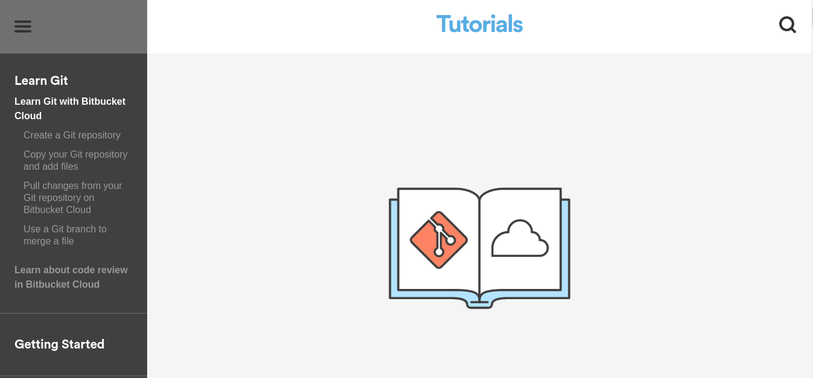

#前言
Note Name: Git 学习笔记 + 流程规范 + 常见问题解决方案
主要为自己记录Git的学习用,内容比较简略,主要为命令行的记录,不适合新手入门.入门推荐廖雪峰的Git教程.


# Git学习资源推荐

[Git Home](https://git-scm.com/)


[Learn Git with bitbucket Cloud](https://www.atlassian.com/git/tutorials/learn-git-with-bitbucket-cloud)




[A Successful Git branching model](http://nvie.com/posts/a-successful-git-branching-model/)


[廖雪峰-Git教程](http://www.liaoxuefeng.com/wiki/0013739516305929606dd18361248578c67b8067c8c017b000)


[5.2 代码回滚：Reset、Checkout、Revert的选择](https://github.com/geeeeeeeeek/git-recipes/wiki/5.2-%E4%BB%A3%E7%A0%81%E5%9B%9E%E6%BB%9A%EF%BC%9AReset%E3%80%81Checkout%E3%80%81Revert%E7%9A%84%E9%80%89%E6%8B%A9)

> 强力推荐 综合了国外的多篇优秀的博客,译作

Download

[Git Cheat Sheet](https://pan.baidu.com/s/1kU5OCOB#path=%252Fpub%252Fgit)

可以打印备用
# 基本概念


## Git本地仓库


## Git 实现原理

小型文件存储系统

快照


## 分支 Branch

Master 分支 

Dev 分支 

Feature branches

## Tag 标签  

例: v1.1.0


# 本地仓库

## Cmd


.git 目录结构


查看git工作区的动态

```
git status
```


查看不同

```
git diff + filename
```

](./IMG/201610091475946616.png)

放弃未add的修改 回退单个文件

```shell
git checkout -- + filename
```


查看历史commit 记录

```
git log
```


SHA1 - > ID


回退到上个版本

> 上个版本HEAD^  上上版本HEAD^^
>
> 上上上....100个,别怕
>
> HEAD~100

```
git reset --hard HEAD^
```


倒回去

```
git reset --hard + ID(部分即可)
```


查看COMMIT/RESET的历史指令及其对应版本

```
git reflog
```


## 工作区 和 暂存区

工作区(Working Directory): 电脑里能看得见的目录

版本库(Repository) = 暂存区(stage) + Branches + Head

HEAD文件保存了当前的branch

版本库 就是 .git文件夹

流程


## 管理修改 跟踪修改

第一次修改 -> `git add` -> 第二次修改 -> `git commit`第二次修改没有被提交


查看工作区和版本库里面最新版本

```
git diff HEAD -- readme.txt
```


​

## 版本回退和提交

### Resetting

#### 提交层面

适用于:私人分支 未提交修改

```
git checkout hotfix
git reset HEAD~2
```


After reset


模式


#### 文档操作


### Reverse

#### 提交层面

适用场景 公共分支 ,已提交更改

```
git checkout hotfix
git reverse HEAD~2
```

Before


After


### Checkout

#### 提交层面


#### 文档层面


```
git checkout HEAD~2 foo.py
```


### Summary


# 远程仓库


## 远程仓库的关联 - 先有了本地仓库

要关联一个远程库，使用命令`git remote add origin git@server-name:path/repo-name.git`；

关联后，使用命令`git push -u origin master`第一次推送master分支的所有内容；

此后，每次本地提交后，只要有必要，就可以使用命令`git push origin master`推送最新修改；

由于远程库是空的，我们第一次推送`master`分支时，加上了`-u`参数，Git不但会把本地的`master`分支内容推送的远程新的`master`分支，还会把本地的`mas`

`ter`分支和远程的`master`分支关联起来，在以后的推送或者拉取时就可以简化命令。

> ? 如何简化了 TODO


## 远程仓库关联 - 先有了远程仓库

```
$ git clone git@github.com:michaelliao/gitskills.git
Cloning into 'gitskills'...
remote: Counting objects: 3, done.
remote: Total 3 (delta 0), reused 0 (delta 0)
Receiving objects: 100% (3/3), done.

$ cd gitskills
$ ls
README.md
```


## 分支管理


创建分支

```
git branch dev
```

切换分支

```
git checkout dev
```

创建分支并合并

```
git checkout -b dev
```


查看分支

```
git branch
```


在dev分支上进行修改并提交

`-a` add then commit 偷懒的写法

```
git commit -a -m "MSG.."
```

>该文件必须时已经追踪的文件里面,如果未追踪需要先 git add filename


合并dev分支到master分支

```
git checkout master

git merge dev

// 可能会出现冲突
```


好了 我们合并成功后,删除dev分支


因为创建、合并和删除分支非常快，所以Git鼓励你使用分支完成某个任务，合并后再删掉分支，这和直接在`master`分支上工作效果是一样的，但过程更安全。

在`--no-ff`模式下进行合并操作,而不是Fast forword

保存merge记录

```
$ git merge --no-ff -m "merge with no-ff" dev
```

Git分支十分强大，在团队开发中应该充分应用。

合并分支时，加上`--no-ff`参数就可以用普通模式合并，合并后的历史有分支，能看出来曾经做过合并，而`fast forward`合并就看不出来曾经做过合并。

## 冲突

哈哈 终于出错了

产生冲突的原因是,之前我在创建新分支的时候,缓存区中有未commit的内容.

或者又做了哪些改动...


手动修改冲突 ,重新提交

 


## 查看分支树


```
git log --graph --pretty=oneline --abbrev-commit
```


## BUG分支

http://www.liaoxuefeng.com/wiki/0013739516305929606dd18361248578c67b8067c8c017b000/00137602359178794d966923e5c4134bc8bf98dfb03aea3000

## Feature分支

新feature -> 试验性代码

> Define 试验性代码

开发一个新feature，最好新建一个分支；

如果要丢弃一个没有被合并过的分支，可以通过`git branch -D `强行删除。


但是，并不是一定要把本地分支往远程推送，那么，哪些分支需要推送，哪些不需要呢？

- `master`分支是主分支，因此要时刻与远程同步；

- `dev`分支是开发分支，团队所有成员都需要在上面工作，所以也需要与远程同步；

- bug分支只用于在本地修复bug，就没必要推到远程了，除非老板要看看你每周到底修复了几个bug；

- feature分支是否推到远程，取决于你是否和你的小伙伴合作在上面开发。

  ​

  ## 多人协作

  ### 当前分支关联远程分支

  ```
  git branch --set-upstream-to=origin/dev dev
  ```

  ​

  

## 远程分支推送


```
xsk@tl:~/ProjLearn/React/ReactWithWebpack$ cat < README.md 
<<<<<<< HEAD
#ReactWithWebpack 
@Author Echo
=======
#ReactWithWebpack
I am the new row.

>>>>>>> 9a5c131f860f3ba7421ef57887cd1ede20f60ba3
Hi,I am Socrion.
```

手动消除冲突

```
#ReactWithWebpack 
@Author Echo

Hi,I am Socrion.

```

再次提交

```
git push
```


为啥还是提示有冲突呢?

你push的是是啥的,不是你工作区目前的样子,需要commit提交到版本库中才可以.

哈哈,忘记提交了.


```
git push
```

提交成功.


# Git Follow规范

### 思想: 尊重构建,互帮互助.


`可为`

* 检查更新
* 运行所有测试
* 定期签入
* 优先修复一个崩溃的构建
* 分小段集成代码,持续集成

`不可为`

*  破坏构建
*  构建没有成功时签入代码,不要commit和签入未完成的代码.
*  注释掉失败的单元测试


### 签入流程
####1.  保持工作区的CLEAN

1.0. 创建新的dev分支


```
git checkout -b dev
```


与origin/dev相关联

```
git branch --set-upstream-to=origin/dev dev
```


1.1  从远程dev分支获取最新的源代码

   ```
   git pull
   ```

####2. 做出改变,准备好签入代码

// Change


####3. 运行测试,(100%) 通过

   ```
   npm run test
   // 不要提交为完成或者有缺陷的代码
   git commit -a -m "msg"
   ```

####4. 检查更新

   ```
   git fetch

   git diff
   ```
   对比看哪里存在冲突

   

####5. 合并分支
```
git merge origin/dev --no-ff -m "merge dev with name conflict"
```
运行结果
```
Merge made by the 'recursive' strategy.
 README.md | 3 ++-
 1 file changed, 2 insertions(+), 1 deletion(-)
```
> **recursive strategy** merge时可以指定合并策略的
> -S -X [TODO]


####6. 再次运行测试

```
npm run test / your test cmd
```
####7. 签入代码

```
$ git push
```


8. 删除本地的dev分支[?]

```
git branch -d dev
```


## 问题解决流程

### [Question] 把有缺陷的版本推动到了远端,引起团队混乱和崩溃

> 缺陷的代码（未经测试或未完成的代码）

**场景** 

<小白程序员在编写一个小模块的代码>

小白:　写呀写呀，咦，不是讲持续集成么，小段提交，我已经写了这么多了，提交一下吧（add & commit）

小白:　咦干脆我提交到远程好啦，这样就不怕丢失了，窃喜　（push）

<过了一会儿>

程序员甲  从远端获取最新的更新,合并,运行前测试,满江红(一篇BUG 保存信息)

程序员甲: 小白,你来一下,你是不是啥,没写好的模块,未经测试的模块你干嘛要提交到远端!!我的工作都没法继续了.

小白: 呀

程序员乙: 小白!...


就这样,因为一个人的错误操作,导致了整个项目组代码的混乱,这个过程中存在的问题时:

* 没有做好代码审查,需要限定小白程序员的权限,对他的代码进行代码审查
* commit了未完成和未测试的代码,并提交到了远端,这是极其

签入的代码有问题,未做测试或者测试有缺陷,大清亡了!


此时需要快速修复,使系统回滚到之前可运行的版本,先让系统能跑啊.


#### `解决方案`

01 - 远程分支 - 回滚

```
// 回退到上一个版本
git reset --hard HEAD~1
// 强行推送,使用本地当前版本,完全替换到远程分支
git push --force
```

02 - 其他程序员 - 撤销当前merge的影响

```shell
xsk@tl:~/Project/SREToolClient$ git log
commit 8ba59533c1c7fe753f78914fcc68c089b61855f7
Author: mushroom-x <xingshunkai@qq.com>
Date:   Sun Oct 9 10:56:50 2016 +0800

    Add Hello.md

commit b86d1a50d2a7a2b2ccc6de525103777fcca644f3
Author: XSKyle <xingshunkai@qq.com>
Date:   Sun Oct 9 10:51:48 2016 +0800

    Update README.md

commit 75a0e81e32ee445c469dd51ef0e60a2dfa4ffad9
Author: XSKyle <xingshunkai@qq.com>
Date:   Sun Oct 9 10:27:59 2016 +0800

    Initial commit

```

**放弃当前的修改,整体回滚**


**只回滚部分受影响的文件**

我想取消掉 commit b86d1a50d2a7a2b2ccc6de525103777fcca644f3

中对README.md的修改

```
撤销
git reset 75a0e8 README.md
重置后取消暂存的变更：
M	README.md
```

现在我们查看下Git Status


[Question] reset修改的啥呢 ?


丢弃工作区的改动

```
// 撤销工作区的修改
git checkout -- README.md
// 保存当前的README.md to 
git add README.md
// 提交修改
git commit -m "delete error code row from README.md"
```


### [Question]出现了BUG怎么办? - 紧急

#### `应用场景`

此时程序员在听歌,一边悠闲的瞧着代码. 

客户: 喂喂,客户反应这个系统有BUG啊,怎么提交失败啊,搞什么嘛!!

程序员: 收到,请告诉我你用的浏览器,操作路径和报错信息等现场情况...

客户:你说的啥呀,我听不懂就给你个截图，你去解决掉吧．

程序员...

#### `解决方案`

保存当前工作区


```
git stash
```


### [Question]撤销操作


1. 未提交到暂存区(git add 之前)

```
git checkout -- readme.txt
```

1. 如果提交到暂存区了,先从暂存区取消掉

```
git reset HEAD readme.txt
```

继续撤销当前修改

```
git checkout -- readme.txt
```


1. 天哪 你都commit了,别慌有哥在

   你是要单独回退一个文件,同时也不想丢失你创建或修改的其他文件

   ```
   // 将工作区的改文件版本回退到对应的commit_id的版本
   git checkout {commit_id} + {filename}
   // 将修改提交到缓存区
   git add filename
   // 将缓存区提交到版本库
   git commit -m "msg"
   ```

   整体回退么?

   ```
   git checkout {commit_id}
   ```

2. 你不光commit了 还推送到了远程分支!!!!

   远程分支的回复

   ```
   git reverse origin/master HEAD~1
   ```

   ​

