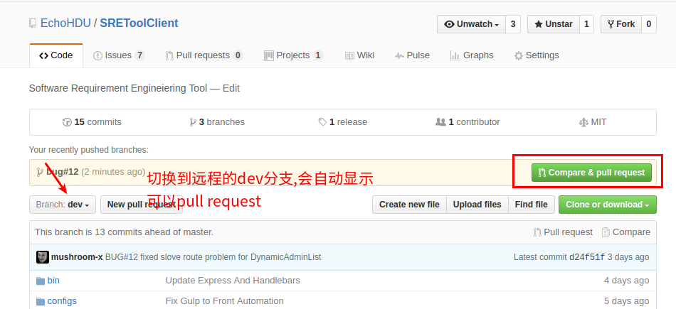
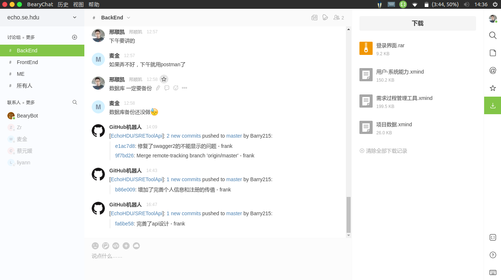

# Github 团队协作

Echo@软工实验班2016

## 预备知识

> Git的基本操作一定要熟练掌握,不能满足于图形化工具,图形化的操作只能满足部分应用场景.
>
> Git是使用Github的基础

### Git

1. Git存储原理(Working Directory, Stage, Commit History)
2. 版本回退(Reset, Reverse, Checkout)
3. 分支(Local Branch, Remote Branch

Github

1. Github账号


## 学习资源

### 课程

[如何使用Git和Github代码版本控制 - Udacity](https://cn.udacity.com/course/how-to-use-git-and-github--ud775)

[Git - 网易微专业](http://pan.baidu.com/share/link?shareid=3517061238&uk=975508831&errno=0&errmsg=Auth%20Login%20Sucess&stoken=2d5610fc2d90852a070b78ab4c35051a4277f2defac3a510b26f68c860077d2d667008a3342222dbfe1f33fc32351d18e7e0a95450c0143a08752378ec7d9b6ad9d9854b4cdb&bduss=f5dc8e5e0f2a2def22e351df7f63f783c1a52315f18ef10b7974d8641169a76d55aec7d3a8857b3f665cdbda1426c9f45a29834490a5c21d4d6daf6883a37f0c3481ff5f665b93c7de6aff04707bf700757ca570d7a69a5526a3de771d64bf854707b47468b10bd79937604d2caacff9fb483070733fed8246900a0410560325515b441b0fb63fc5e6625a88c07f8e3fc37236b45a016d503fa40883397d046b45914a76668db9b3f8c9f1d87c5bd6cc5473678e5dafd45c305506cf496239496f41e5992bc3&ssnerror=0#list/path=%2F)

### Blog

[Git教程 - 廖雪峰](http://www.liaoxuefeng.com/wiki/0013739516305929606dd18361248578c67b8067c8c017b000/)

[Team Collaboration With GitHub](https://code.tutsplus.com/articles/team-collaboration-with-github--net-29876)

> 强烈推荐此篇博客 详细介绍并对比了两种协作方法.(附视频介绍)

[GotGithub - Jiangxin](http://www.worldhello.net/gotgithub/index.html)


[Github Workflow - Github](https://guides.github.com/introduction/flow/)

[Github Flow-Scott Chacon](http://scottchacon.com/2011/08/31/github-flow.html)

## 合作者模式 Collaborators

Fork+Pull的模式为常见的开源项目开发方式.

仓库为个人所有, 项目参与人员首先把仓库fork到自己的仓库里,对代码提交修改,然后给元分支提交Pull Request.

即告诉该项目的拥有者: 嘿,我在你的基础上修改了代码,你做一下代码审查,看能不能添加到你的dev分支里面.

...

详情请见 > [GotGithub- Fork + Pull 模式](http://www.worldhello.net/gotgithub/04-work-with-others/010-fork-and-pull.html)


## 组织模式 Organizations

通过组织的方式对一组代码仓库和多个团队统一管理, 权限管理分配和代码协作比较有效率. 这是我们小组所采用的方式.

详情请见 > [GotGithub - 组织和团队](http://www.worldhello.net/gotgithub/04-work-with-others/030-organization.html)


## 我们该如何选择团队协作方式?

**Organizations vs Collaborators **

若使用“Fork + Pull”的工作模式，通过个人账号还是组织账号托管版本库，几乎没有什么差别。如果一定要找出点不同，那就是在向托管版本库提交Pull Request时，邮件通知的用户范围有所不同。

- 对于个人账号，对其托管空间内的版本库发出Pull Request，通知邮件会发送给该个人账号及该版本库设置的所有协作者（如果有的话）的邮箱。
- 对于组织，对其托管空间内的版本库发出Pull Request，不会向组织的邮箱发送Pull Request，也不会向组织的所有者（Owner团队）发送通知邮件，而是向在版本库中拥有Push权限的团队（非Owner团队）成员发送通知邮件。

因此，如果在组织的托管空间创建版本库，一定要要为版本库指派一个拥有Push权限的团队，以免以“Fork + Pull”模式工作时，Pull Request没有人响应。

若是以共享版本库方式（即集中式协同模式）工作的话，使用组织来托管版本库会比使用个人账号托管有效率得多。

- 以个人账号托管，需要逐一为版本库设置协作者（Collaborators），如果版本库较多且授权相同，配置过程繁琐且易出错。

- 以组织方式托管，将用户分组，划分为一个一个的团队（Team），以团队为单位授权则方便得多。

- 如果是以付费账号创建的私密版本库，使用组织方式管理，会有包括只读、读写等更丰富的授权类型，更符合项目管理的实际。

  ​


## 我们的方案

**团队协作方案 @Echo**


### Organizations 组织架构

#### 团队成员 People

管理员:XSK

Note: 组织创建人拥有组织的最高权限

Invite member 邀请团队成员,填入团队成员邮箱.

成员访问团队主页,会显示邀请信息(千万别傻傻的等邀请邮件,并没有)


#### 团队Team

我们的团队主要就分了两组,如果大家觉得有些冗余的化,就创建一个Team也是可以的. 

因为我们采取的是严格的前后端分离,所以划分为两个Team

`BackEnd` 后端开发团队 

`FrontTeam` 前端开发团队


##  

### 代码仓库


采用API架构 ,前后端分离

`SREToolAPi` 后台仓库

`SREToolClient` 前端仓库

### 权限管理

Organizations 中对仓库的权限管理是以Team为组的,也就是说,对于同一个仓库,同一个Team用有对该仓库的同等权限


### 分支管理


`Master Branch` 

[受保护分支]

协同模式：Pull - Request 

理由: Master分支为正式发布版本,不可随意变更. 所以对于Master分支的修改操作需要团队负责人(XSK)代码审查

 `Dev Branch`　

协同模式

理由: 团队规模四个,职责相对比较明确,每个人不需要采用非常繁琐的Pull - Request的工作流程.

所有人都拥有Push权限. 如果出现因为个别团队成员操作失误引起的问题,则共同协作解决. 

Code Review 一周进行一次.

#### `Feature`分支 

当要创建一个新的功能模块的时候,创建一个新增功能分支

使用方式与Bug分支类似

#### `Bug` 分支

首先出现Bug了,首先要在ISSUE中创建一个项

指定负责人


之后,在本地为修复一个Bug创建的分支

```shell
// 先切换到dev分支
git checkout dev

// 从dev分支分出来,可以加上在issue上这个Bug的ID
git checkout -b bug#12
```

如果解决Bug需要多人协作,可以推送到远程分支

```shell
git push origin bug#12:bug#12
```


在github上在bug#12分支上,给dev分支提交一个pull request




团队负责人进行代码审核


merge pull request


Bug解决之后,将bug分支合并到dev分支,之后将Bug分支删除

远程分支删除


本地Bug分支的删除


### 辅助工具

#### 消息提醒

[BearyChat + Github Webhook](https://bearychat.com/integrations/github)



[Webhook介绍](https://developer.github.com/webhooks/)

简单来说就是Github对仓库的一些操作(例如PUSH)触发的事件.

CI 持续集成

#### CI 持续集成

Jenkins (还没投入使用 先列在这里)


#### 更多工具

https://github.com/integrations